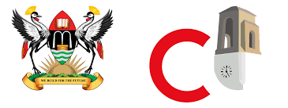

# Student Feedback System - Group T

## Table of Contents

- [Introduction](#introduction)
- [Installation](#installation)
- [Getting Started](#getting-started)
- [Interface Design](#interface-design)
- [License](#license)

## Introduction

## Scope

This software will provide support for universities that wish to have a structured and organized format to get and evaluate feedback from the students about the instructors, courses and campus facilities.

### Goals and Objectives

The primary goal of this software design project is to develop a comprehensive and user-friendly system that facilitates universities in obtaining, managing, and analyzing feedback from students, with a focus on instructors, courses, and campus facilities. By achieving this overarching goal, the software aims to fulfill the following specific objectives:

### Streamlined Feedback Collection

The software will enable universities to effortlessly gather feedback from students through a well-designed and intuitive interface. It will offer a standardized mechanism for students to share their opinions on instructors, courses, and campus facilities, ensuring that the feedback collection process is convenient and consistent across various departments and programs.

### Comprehensive Data Management

Our software will provide universities with a centralized platform to efficiently manage and store the collected feedback data. It will organize the feedback submissions, ensuring accurate categorization and easy retrieval. This objective includes implementing features for data filtering, sorting, and search functionalities, allowing university administrators to access relevant information swiftly.

### In-depth Analysis and Reporting

The software will empower universities to gain valuable insights from the accumulated feedback data. It will offer robust analytical tools that allow administrators to generate insightful reports, charts, and graphs. By identifying trends and patterns, universities can make informed decisions to enhance the quality of instruction, curriculum, and campus facilities.

### User-Friendly Experience

Our software will prioritize user experience, ensuring that both students and administrators find the interface intuitive and easy to navigate. User-friendly design and clear instructions will be integral to achieving this objective, contributing to increased participation and effective utilization of the feedback system.

## Installation

1. Navigate to the [src/group_work/django-student-feedback-system](Recess_Project/src/group_work/django-student-feedback-system) folder directory which is the project directory

2. In the project directory run `pip install -r requirements.txt`

3. Then start the server by running the command `python manage.py runserver`

## Getting Started

### Admin Signin

Open your web browser and navigate to `localhost:8000/admin_signin`
Sign in as an admin using the following credentials:
`Username: admin`
`Password: 123`

### Student Signin

Open your web browser and navigate to `localhost:8000/signin`.

### Student Signup

Open your web browser and navigate to `localhost:8000/signup`.

## Interface Design

Admin Signin

Student Signin

Student Signup

Student Dashboard

Student Forms

Admin Dashboard

Admin Forms Section

View All Forms

Create Form

Add Question

View Summary Data

## ❗️ Note:

- The project will run for 2 weeks starting on 24th July 2022 to 11th August 2023 till 11:59 pm.
- Email us: jeff.geoff.cis@gmail.com cc. ndigezzalivingstone2@gmail.com and send us the link for the GitHub Repository!

## License

This project is licensed under the [MIT License](./LICENSE). 

---
